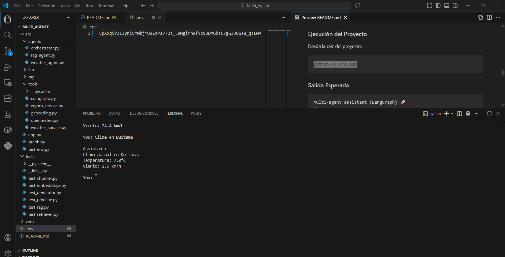
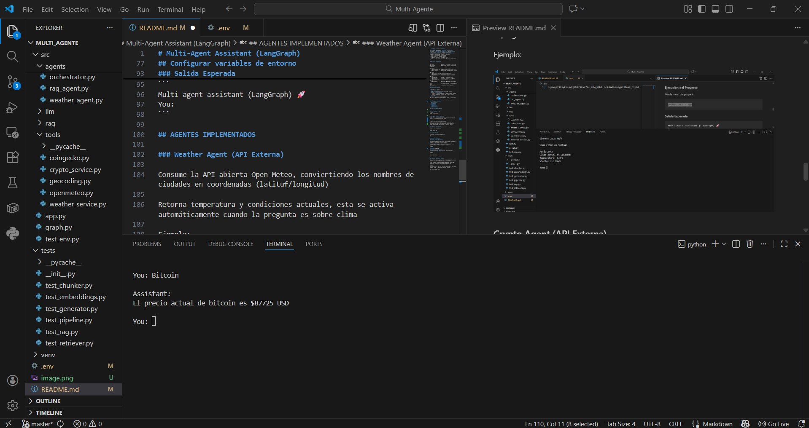
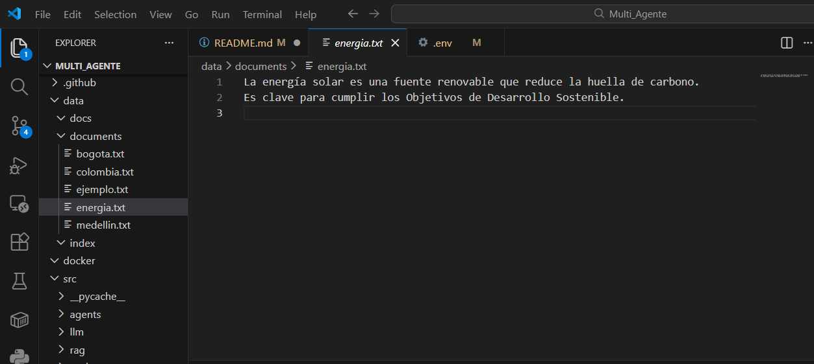
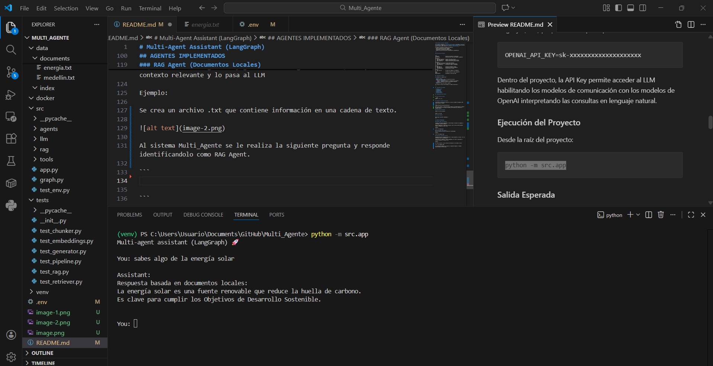

# Multi-Agent Assistant (LangGraph)

Este proyecto implementa un **asistente multi-agente** utilizando **LangGraph** y **LangChain**, capaz de **enrutar preguntas automáticamente** hacia distintos agentes especializados mediante el uso de un **LLM como router**.

El objetivo principal del proyecto es demostrar:
- Diseño de arquitecturas multi-agente
- Uso de grafos para routing y handoffs
- Integración con modelos de lenguaje (LLM)
- Buenas prácticas de estructura, configuración y documentación

---

## Estructura del Proyecto

```
src/
├── app.py                 # Punto de entrada de la aplicación
├── graph.py               # Definición del flujo multi-agente (LangGraph)
│
├── agents/
│   ├── weather_agent.py   # Agente clima (API externa)
│   ├── crypto_agent.py    # Agente criptomonedas (API externa)
│   └── rag_agent.py       # Agente RAG sobre documentos locales
│
├── tools/
│   ├── weather_service.py # Consumo API Open-Meteo
│   ├── crypto_service.py  # Consumo API pública de precios
│   └── geocoding.py       # Conversión ciudad → coordenadas
│
├── rag/
│   ├── loader.py          # Carga de documentos locales
│   ├── chunker.py         # División de texto en fragmentos
│   └── embeddings.py      # Vectorización (TF-IDF)
│
├── llm/
│   └── client.py          # Cliente LLM (OpenAI via LangChain)
│
tests/                     # Pruebas unitarias de cada componente
data/
└── documents/             # Documentos locales para RAG
```

##  Arquitectura General

El sistema está compuesto por:

- **Router (LLM)**  
  Decide a qué agente enviar la consulta del usuario.
- **Agentes especializados**
  - `RagAgent`: Respuestas basadas en recuperación de contexto
  - `QaAgent`: Respuestas directas tipo pregunta-respuesta
- **LangGraph**
  Orquesta el flujo entre nodos y agentes.

*El routing se realiza dinámicamente en tiempo de ejecución.*

---

##  Tecnologías Utilizadas

- **Python 3.11+**
- **LangGraph**
- **LangChain**
- **OpenAI API**
- **scikit-learn**
- **python-dotenv** 

##  Configuración del Entorno


### Crear entorno virtual

```bash
python -m venv venv
```
s
## Configurar variables de entorno

La API Key se utiliza para autenticar el acceso al modelo de lenguaje (LLM) proporcionado por OpenAI.

``` 
OPENAI_API_KEY=sk-xxxxxxxxxxxxxxxxxxxx 
```
Dentro del proyecto, la API Key permite acceder al LLM habilitando los modelos de comunicación con los modelos de OpenAI interpretando las consultas en lenguaje natural.

### Ejecución del Proyecto

Desde la raíz del proyecto:

```
python -m src.app
```
### Salida Esperada

```
Multi-agent assistant (LangGraph) 🚀
You:
```

## AGENTES IMPLEMENTADOS 

### Weather Agent (API Externa)

Consume la API abierta Open-Meteo, conviertiendo los nombres de ciudades en coordenadas (latituf/longitud)

Retorna temperatura y condiciones actuales, esta se activa automáticamente cuando la pregunta es sobre clima

Ejemplo:



### Crypto Agent (API Externa)
Realiza consultas de precios actuales de criptomonedas

Ejemplo:



### RAG Agent (Documentos Locales)

Implementa Retrieval Augmented Generation, carga documentos y archivos .txt con información para su procesamiento.

Divide texto en fragmentos y genera embeddings con TF-IDF, recopilando el contexto relevante y lo pasa al LLM

Ejemplo:

Se crea un archivo .txt que contiene información en una cadena de texto.



Al sistema Multi_Agente se le realiza la siguiente pregunta y responde identificandolo como RAG Agent.




