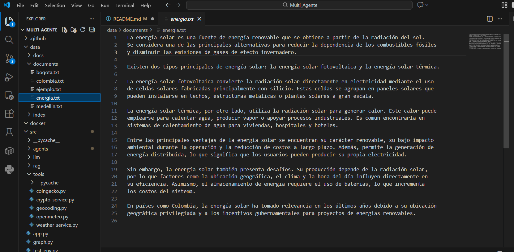

# Multi-Agent Assistant (LangGraph)

This project uses a multi-agent assistant using LangGraph and LangChain , which is capable to enroute prompts automatically through specific agents supported by LLM process

The main goal for the project is to demonstrate:

- Multi-agent architecture design using LangGraph
- Intelligent routing of user queries
- Integration of Large Language Models (LLMs)
- Use of external APIs without authentication keys
- Retrieval-Augmented Generation (RAG) over local documents
- Best practices for project structure, configuration, and documentation

## Project Architecture Overview

```
src/
├── app.py                 # App Entry point
├── graph.py               # Multi-agent definition process
│
├── agents/
│   ├── weather_agent.py   # weather agent (external API)
│   ├── crypto_agent.py    # crypto agent (external API)
│   └── rag_agent.py       # RAG agent over local documents
│
├── tools/
│   ├── weather_service.py # API Open-Meteo
│   ├── crypto_service.py  # API public currencies
│   └── geocoding.py       # City - coordinates 
|   └── openmeteo.py       # Weather data
conversion
│
├── rag/
│   ├── loader.py          # Local documents load
│   ├── chunker.py         # Tex segmentation 
│   └── embeddings.py      # Vectorization (TF-IDF)
│
├── llm/
│   └── client.py          # LLM client configuration
│
tests/                     # Component Unit Test
data/
└── documents/             # Local documents over RAG

```

##  General Model Structure

The sistem is based on:

- **Router (LLM)**  

  The user request using through a mechanism that analyzes user input and determines which specialized agent should handle the request.
  
  The router prioritizes:
- Deterministic intent detection
- LLM-based fallback classification when intent is ambiguous

- **Specialized Agents**

- **LangGraph**
  Node agent management and is used for manage execution flow between agents.

##  Modules versión used

- Python 3.11+
- LangGraph
- LangChain
- OpenAI API (LLM reasoning)
- Open-Meteo API (weather, no API key)
- CoinGecko API (crypto prices, no API key)
- Nominatim OpenStreetMap API (geocoding, no API key)
- scikit-learn (TF-IDF embeddings)
- python-dotenv (environment variables

##  Environment Settings

A Python virtual environment is used to isolate dependencies and ensure reproducibility.

###  Virtual Enviroment Deployment
The project used a Python virtual environment for manage the dependences (LangChain, LangGraph)

Virtual Environment creation:

```bash
python -m venv venv
```
Virtual Environment activation:

```bash
venv\Scripts\Activate
```
## Environment Variables Settings

The APY KEY is used for language model (LLM) authentication given by OpenAI

``` 
OPENAI_API_KEY=sk-xxxxxxxxxxxxxxxxxxxx 
```
The API Key allows the access to LLM , by activating the comunication models with OPen AI models, interpreting every request in natural language process.

### Project Execution

From the project root:

```
python -m src.app
```
### Expected Output

```
Multi-agent assistant (LangGraph) 🚀
You:
```

## Implemented Agents 

### Geocoding Agent (External API)

The Geocoding Agent resolving natural language location queries into precise geographic coordinates using the Nominatim API from OpenStreetMap.


### Weather Agent (External API)

Return weather conditions according to request provided by the user, when the question is related with that matter.

E.g:


### Crypto Agent (External API)

Perform requestes about crypto currencies.

E.g:


### RAG Agent (Local Documents)

(Retrieval Augmented Generation), documents and 
archives loading in .txt format with key information for processing.

Text segmentation and embedding with TF-IDF, collecting the relevant context and received by LLM.

E.g:

It is created a .txt archive with information in string format.



When a request is sent to multi-agentit is recognized as a RAG agent. 


## Final Notes

This project demonstrates how a modular multi-agent system can:
- Combine LLM reasoning with deterministic logic
- Integrate external APIs without authentication overhead
- Extend capabilities through document-based knowledge
- Scale easily by adding new agents

The architecture is designed to be extensible, maintainable, and aligned with real-world AI system design practices.

Autor: Fabian Leonardo Ortiz Cuevas

Elctronic Engineer

Email: fabioleorcu20@gmail.com