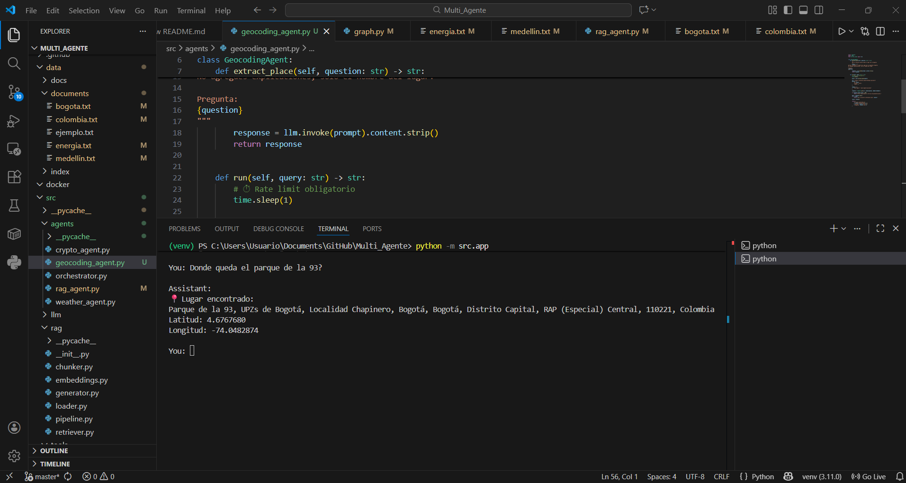

# Multi-Agent Assistant (LangGraph)

This project uses a multi-agent assistant using LangGraph and LangChain , which is capable to enroute prompts automatically through specific agents supported by LLM process

The main goal for the project is to demonstrate:

- Multi-agent architecture design
- LLM models integration language
- Best practives for model structure, configuration and documentation

## Estructura del Proyecto

```
src/
├── app.py                 # App Entry point
├── graph.py               # Multi-agent definition process
│
├── agents/
│   ├── weather_agent.py   # weather agent (external API)
│   ├── crypto_agent.py    # crypto agent (external API)
│   └── rag_agent.py       # RAG agent over local documents
│
├── tools/
│   ├── weather_service.py # API Open-Meteo
│   ├── crypto_service.py  # API public currencies
│   └── geocoding.py       # City - coordinates conversion
│
├── rag/
│   ├── loader.py          # Local documents load
│   ├── chunker.py         # Tex segmentation 
│   └── embeddings.py      # Vectorization (TF-IDF)
│
├── llm/
│   └── client.py          # LLM client (OpenAI via LangChain)
│
tests/                     # Component Unit Test
data/
└── documents/             # Local documents over RAG

```

##  General Model Structure

The sistem is based on:

- **Router (LLM)**  
  Decides to which agent sent the user request
  
- **Specialized Agents**
  - `RagAgent`: Response based on context recovering.
  - `QaAgent`: Direct responses through one question - one answer mode
  
- **LangGraph**
  Node agent management.

##  Modules versión used

- **Python 3.11+**
- **LangGraph**
- **LangChain**
- **OpenAI API**
- **scikit-learn**
- **python-dotenv** 

##  Environment Settings


###  Virtual Enviroment Deployment

```bash
python -m venv venv
```

## Environment Variables Settings

The APY KEY is used for language model (LLM) authentication given by OpenAI

``` 
OPENAI_API_KEY=sk-xxxxxxxxxxxxxxxxxxxx 
```
The API Key allows the access to LLM , by activating the comunication models with OPen AI models, interpreting every request in natural language process.

### Project Execution

From the project root:

```
python -m src.app
```
### Expected Output

```
Multi-agent assistant (LangGraph) 🚀
You:
```

## Implemented Agents 

### Geocoding Agent (External API)



### Weather Agent (External API)

Return weather conditions according to request provided by the user, when the question is related with that matter.

E.g:


### Crypto Agent (External API)

Perform requestes about crypto currencies.

E.g:


### RAG Agent (Local Documents)

(Retrieval Augmented Generation), documents and 
archives loading in .txt format with key information for processing.

Text segmentation and embedding with TF-IDF, collecting the relevant context and received by LLM.

E.g:

It is created a .txt archive with information in string format.


When a request is sent to multi-agentit is recognized as a RAG agent. 


