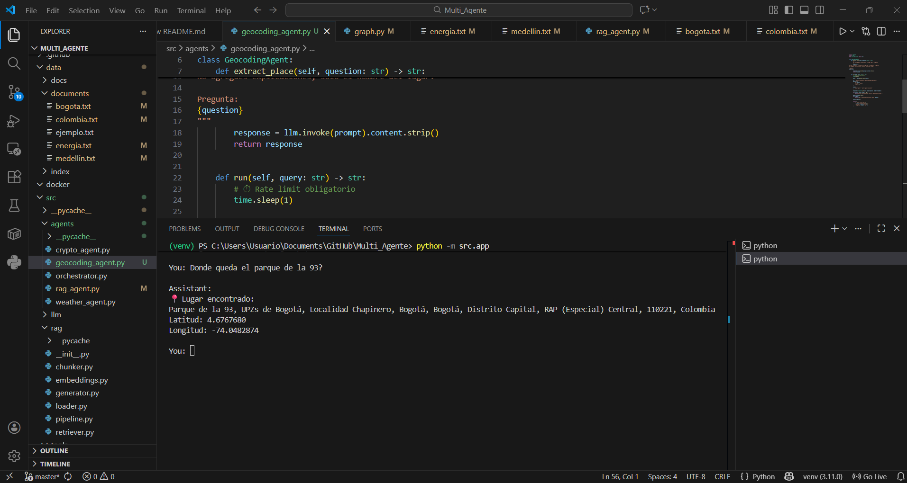
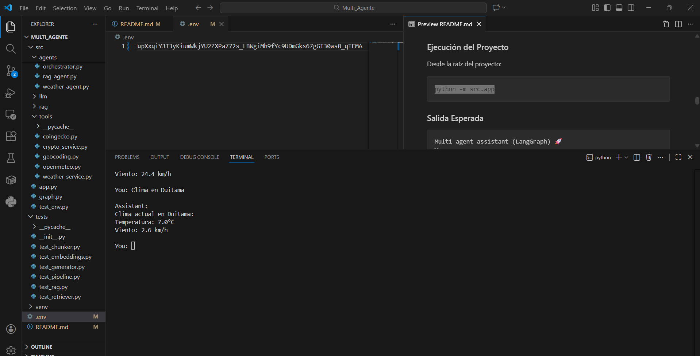
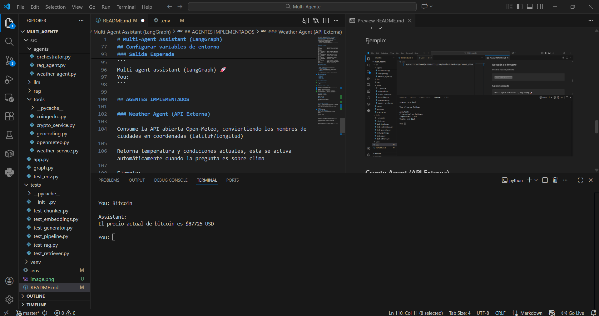
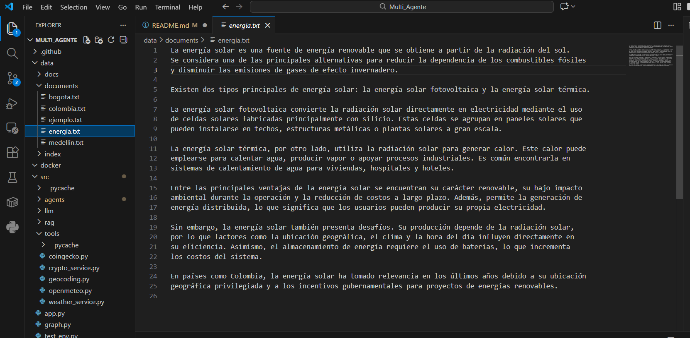
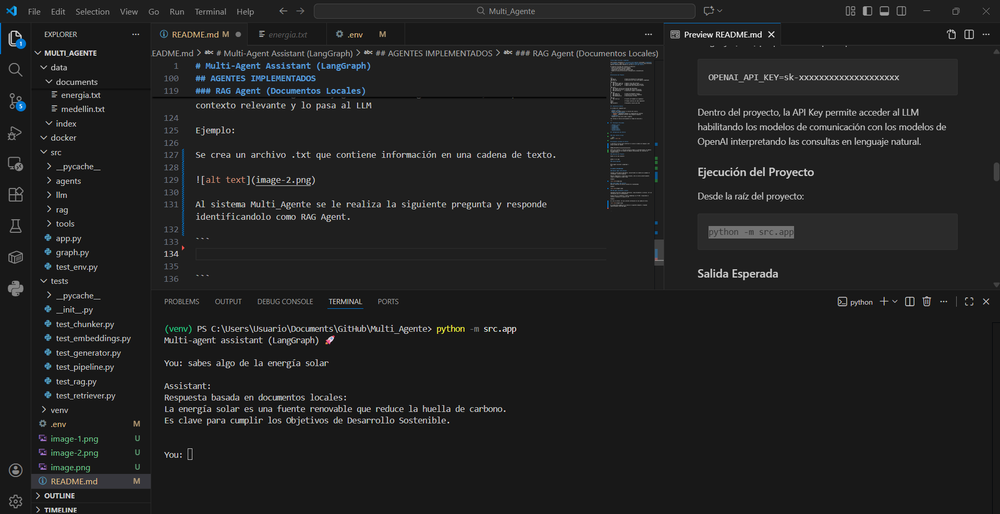

# Multi-Agent Assistant (LangGraph)

This project uses a multi-agent assistant using LangGraph and LangChain , which is capable to enroute prompts automatically through specific agents supported by LLM process

The main goal for the project is to demonstrate:

- Multi-agent architecture design using LangGraph
- Intelligent routing of user queries
- Integration of Large Language Models (LLMs)
- Use of external APIs without authentication keys
- Retrieval-Augmented Generation (RAG) over local documents
- Best practices for project structure, configuration, and documentation

## Project Architecture Overview

```
src/
├── app.py                 # Console-based assistant entry point
├── server.py              # FastAPI HTTP service
├── graph.py               # Multi-agent definition process
│
├── agents/
│   ├── weather_agent.py   # weather agent (external API)
│   ├── crypto_agent.py    # crypto agent (external API)
│   ├── geocoding_agent.py # geocoding helper agent
│   └── rag_agent.py       # RAG agent over local documents
│
├── tools/
│   ├── weather_service.py # Open-Meteo weather API
│   ├── crypto_service.py  # CoinGecko crypto prices API
│   └── geocoding.py       # City coordinates lookup
│
├── rag/
│   ├── loader.py          # Load local documents
│   ├── chunker.py         # Text segmentation / chunking
│   ├── embeddings.py      # TF-IDF embeddings
│   ├── retriever.py       # Document retrieval logic
│   ├── pipeline.py        # RAG pipeline helpers
│   └── generator.py       # Local answer generation
│
├── llm/
│   └── client.py          # LLM client configuration
│
tests/                     # Component unit tests
data/
└── documents/             # Local documents for RAG

```

##  General Model Structure

The sistem is based on:

- **Router (LLM)**  

  The user request using through a mechanism that analyzes user input and determines which specialized agent should handle the request.
  
  The router prioritizes:
- Deterministic intent detection
- LLM-based fallback classification when intent is ambiguous

- **Specialized Agents**

- **LangGraph**
  Node agent management and is used for manage execution flow between agents.

##  Modules versión used

- Python 3.11+
- LangGraph
- LangChain
- OpenAI API (LLM reasoning)
- Open-Meteo API (weather, no API key)
- CoinGecko API (crypto prices, no API key)
- Nominatim OpenStreetMap API (geocoding, no API key)
- scikit-learn (TF-IDF embeddings)
- python-dotenv (environment variables

## Environment Settings

A Python virtual environment is used to isolate dependencies and ensure reproducibility.

### Virtual Environment Deployment

Create the environment:

```bash
python -m venv .venv
```

Activate the environment:

```bash
.venv\Scripts\Activate
```

### Install Dependencies

```bash
pip install -r requirements.txt
```

### Environment Variables

Copy the template file to `.env` and add your OpenAI API key:

```bash
copy .env.template .env
```

Then edit `.env`:

```env
OPENAI_API_KEY=sk-xxxxxxxxxxxxxxxxxxxx
```

This key is required for the LLM client to work.

## Running the Project

### 1) Console mode

Start the assistant in terminal mode:

```bash
python -m src.app
```

Expected output:

```text
Multi-agent assistant (LangGraph) 🚀
You:
```

### 2) HTTP API mode

Start the FastAPI server:

```bash
uvicorn src.server:app --reload --port 8000
```

Then open:

- `http://localhost:8000` for the root health check
- `http://localhost:8000/docs` for Swagger UI
- `http://localhost:8000/redoc` for API docs

### API Usage Example

Use POST `/chat` with JSON body:

```json
{
  "message": "clima en bogota"
}
```

Sample curl request:

```bash
curl -X POST "http://localhost:8000/chat" -H "Content-Type: application/json" -d "{\"message\": \"precio de bitcoin\"}"
```

## Postman Example

- Method: POST
- URL: `http://localhost:8000/chat`
- Body type: raw JSON
- Body content:

```json
{
  "message": "clima en medellin"
}
```

The service will respond with the selected agent's output.

## Implemented Agents 

### Geocoding Agent (External API)

The Geocoding Agent resolving natural language location queries into precise geographic coordinates using the Nominatim API from OpenStreetMap.



### Weather Agent (External API)

Return weather conditions according to request provided by the user, when the question is related with that matter.

E.g:



### Crypto Agent (External API)

Perform requestes about crypto currencies.

E.g:



### RAG Agent (Local Documents)

(Retrieval Augmented Generation), documents and 
archives loading in .txt format with key information for processing.

Text segmentation and embedding with TF-IDF, collecting the relevant context and received by LLM.

E.g:

It is created a .txt archive with information in string format.



When a request is sent to multi-agentit is recognized as a RAG agent. 



## Final Notes

This project demonstrates how a modular multi-agent system can:
- Combine LLM reasoning with deterministic logic
- Integrate external APIs without authentication overhead
- Extend capabilities through document-based knowledge
- Scale easily by adding new agents

The architecture is designed to be extensible, maintainable, and aligned with real-world AI system design practices.

Autor: Fabian Leonardo Ortiz Cuevas

Elctronic Engineer

Email: fabioleorcu20@gmail.com